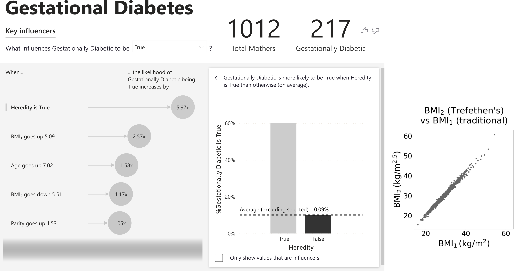

# TeX-Styling-Power-BI

Styling Power BI dashboards with TeX.

---

<figure style="width:700px;">
  
  <figcaption>Figure 1. TeX-styled Power BI dashboard for a gestational diabetes dataset.</figcaption>
</figure>

---

### Key Files

- GreyNeutralTheme.json &nbsp;&nbsp; Power BI theme. 
- TexStyledDashboard.pbix &nbsp;&nbsp; Power BI dashboard. 

The Power BI dashboard holds native visuals and a Matplotlib scatterplot. An example gestational diabetes dataset is embedded. The scatterplot showcases TeX-styling visuals compatible with both local (Power BI Desktop) and online (Power BI Service) rendering. The accompanying, grey-based theme provides accessibility to colour blind users.

### Software Requirements

- Power BI Desktop (for local rendering). 
- Power BI Service (for online rendering). 
- Python (for local rendering). 

### Python Configuration

As the dashboard uses Python-enabled visuals, Power BI should be configured to execute Python. To do this, via the Power BI 2025 menu options, go to:

- File -> Options and settings -> Options -> Global -> Python scripting.
- Ensure a valid path to a Python installation is specified in the "Detected Python home directories" field.

Please ensure the following Python packages are installed:

- matplotlib.
- pandas.

### Reference

Stenborg, T 2025, "[Styling Microsoft Power BI dashboards with TeX](https://tug.org/TUGboat/tb46-1/tb142stenborg-powerbi.pdf)", TUGboat, vol. 46, no. 1, pp. 156&ndash;157.
